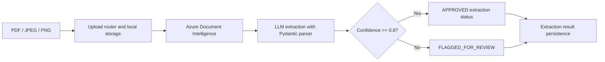

# Intelligent Healthcare Claims System

**From unstructured claim documents to structured, reviewable data.**

A backend prototype combining document OCR, schema-based LLM extraction, and claim validation to support healthcare document review.

[Workflow](#workflow) · [Engineering highlights](#engineering-highlights) · [Explore the code](#explore-the-code) · [Development](#development) · [Project status](#project-status)

## Overview

Healthcare claim documents contain patient details, provider information, service dates, and billing amounts in inconsistent formats. This project explores a workflow that turns those documents into structured records while retaining extraction reasoning and identifying records that need further review.

The repository contains a document upload router, Azure OCR integration, a LangGraph extraction workflow, normalized Pydantic claim schemas, a separate validation agent, and SQLAlchemy persistence models. It is an **integration prototype**; the current checkout requires fixes before the complete API can run.

## Workflow

The graph's `APPROVED` label describes extraction confidence, not an insurance coverage or payment decision. Both branches terminate the graph; there is no implemented reviewer interface.

A separate validation component checks normalized claim data for missing fields, inconsistent dates, unusual billing amounts, and LLM-detected semantic issues. It returns severity-tagged issues, a validation score, and recommended next steps; it is not yet connected to the extraction graph.

## Engineering highlights

| Area | Implementation |
| --- | --- |
| Structured extraction | Pydantic output parsing for patient, provider, service date, amount, confidence, and reasoning; prompt instructions preserve missing values as null. |
| Explicit orchestration | A typed LangGraph state passes OCR output through extraction and confidence routing. |
| Data normalization | Canonical claim schemas parse common date formats and currency strings into dates and decimal amounts. |
| Layered validation | Deterministic completeness, date, and amount checks are combined with semantic checks in a separate agent. |
| Traceable results | Persistence models capture extracted data, confidence, reasoning, engine, and version. |
| Document lifecycle | Transition rules describe upload, extraction, failure, and retry states. |

## Explore the code

- [Extraction graph](agents/graphs/extraction_graph.py): workflow state, nodes, and routing.
- [Extraction agent](agents/extraction_agent.py): Google/OpenAI provider selection and structured output parsing.
- [Claim schema](schema/claim_data.py): normalized patient, provider, service, and billing data.
- [Validation agent](agents/validation_agent.py): rule-based checks, semantic checks, scoring, and recommendations.
- [Document API](api/documents.py): upload and extraction endpoint definitions.
- [Services](services/): storage, document lifecycle, and persistence orchestration.
- [Tests](tests/): schema, validation, OCR, and extraction test cases.

## Development

### Environment and dependencies

Python 3.12 dependencies are pinned in `pyproject.toml` and `uv.lock`. Run `uv sync --locked`; see the [development guide](docs/development.md) for configuration and credential-free checks.

The Azure extractor reads `AZURE_DOCUMENT_INTELLIGENCE_ENDPOINT` and `AZURE_DOCUMENT_INTELLIGENCE_KEY` from the environment. The default LLM provider is Google; its integration requires `GOOGLE_API_KEY`. Selecting OpenAI requires `OPENAI_API_KEY` and an appropriate model name. Set `LLM_MODEL` explicitly to a model available to the selected provider account before attempting live calls. Provider clients initialize only when used.

The database connection reads `DATABASE_URL` when first used, and uploaded documents are written under configurable `UPLOAD_DIR` (default `uploads/`). Use synthetic documents when exploring the prototype.

### API surface

| Method | Route | Intended behavior |
| --- | --- | --- |
| `POST` | `/claim/{claim_id}/documents` | Store a PDF, JPEG, or PNG attachment and create a document record. |
| `POST` | `/documents/{document_id}/extract` | Run extraction and return document ID, confidence, and claim state. |

These routes are defined in an `APIRouter`; an application entry point that mounts the router is not included. Although extraction returns HTTP 202, the current handler runs the pipeline synchronously.

## Project status

Implemented components demonstrate the extraction and validation design, but the repository is not yet an end-to-end runnable service. The remaining integration work includes:

- Add an application entry point and database migrations.
- Complete the normalized result pipeline and durable job integration; repaired ORM models and [versioned migrations](docs/database.md) provide the persistence foundation.
- Expand synthetic end-to-end and live-provider evaluation beyond the passing unit/persistence suite.
- Connect normalization and validation to the extraction workflow and complete review handling.
- Validate provider model configuration and Azure API compatibility with pinned dependencies.

The current unit and PostgreSQL persistence tests pass without live providers. They do not establish end-to-end extraction accuracy. See [contributing](CONTRIBUTING.md) for CI, review, and integration requirements.

## Implementation roadmap

The next milestone is the [end-to-end synthetic claim demo](https://github.com/jengaWiz/Intelligent-Healthcare-Claims-system/milestone/1). See the [workflow contract](docs/m1-contracts.md), [architecture decision](docs/decisions/001-durable-processing.md), and [ticket checklist](https://github.com/jengaWiz/Intelligent-Healthcare-Claims-system/issues/16). These describe the implementation target; current behavior is summarized above.
