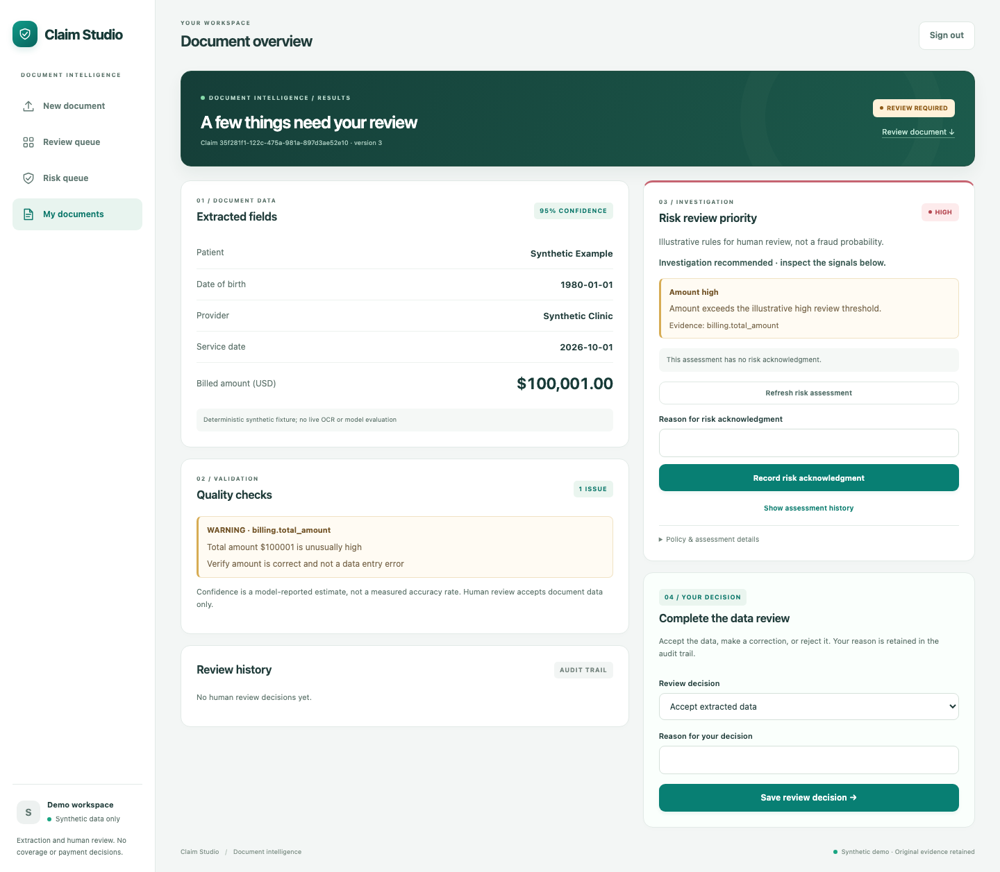
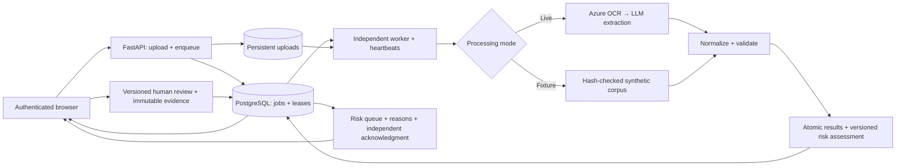

<div align="center">

# Intelligent Healthcare Claims System

**From unstructured documents to explainable risk triage and human-reviewed data.**


A runnable synthetic healthcare document demo with durable background processing,
structured extraction, quality checks, explainable risk classification, and an
audited reviewer workspace.

[Run the demo](#run-the-demo) · [Architecture](#architecture) · [Engineering](#engineering-highlights) · [Verification](#verification-and-limits)

</div>

> [!IMPORTANT]
> **Deployment choice: local Docker, no always-on cloud hosting.**
>
> This portfolio demo is intentionally distributed as a reproducible Docker Compose
> deployment to avoid recurring cloud compute, database, and storage costs for an
> intermittently used project. The default synthetic mode also avoids billable
> Azure OCR and LLM requests, so reviewers can explore the workflow without provider accounts.
>
> **Deployment engineering is implemented and verified:** separate API/worker
> containers, PostgreSQL and persistent uploads, pinned images, nonroot execution,
> migration gates, health checks, restart recovery, and paired backup/restore.
> CI exercises the container deployment; the [verification report](docs/verification/compose.json)
> records the smoke, restart, restore, and retained-image redeploy checks.
>
> Start the [local demo](#run-the-demo) or browse the screenshots below.
> The [deployment runbook](docs/deployment.md) documents operation and rollback.
> A public deployment would additionally require a hosting target, HTTPS ingress,
> and environment-specific configuration; those have not been provisioned or verified.


## What it does

Upload a synthetic PDF, JPEG, or PNG, follow a persisted processing job, inspect
normalized fields and quality issues, and correct or reject records that need
human review. The original extraction remains intact, with each review retaining
actor, reason, timestamp, version, and before/after values.

Every successful extraction receives a versioned **LOW, MEDIUM, HIGH, or
INSUFFICIENT_DATA** assessment. Reviewers see the triggered rules, refresh duplicate
context, investigate a prioritized risk queue, and acknowledge a specific assessment
with a reason. Corrections create new assessments while preserving prior evidence.

<details>
<summary>See the high-risk investigation workflow</summary>



</details>

Risk is **human review priority** under an illustrative rules policy. It is not a
fraud probability; LOW does not establish absence of fraud. Data approval and risk
investigation are separate, so a READY claim can remain HIGH risk.

**READY means document data is ready.** It does not authorize insurance coverage
or payment. This project uses synthetic documents and makes no production
compliance claim.

## Run the demo

Requires Docker Compose, Python 3.12, and uv. No provider account is needed for the
local fixture demo.

```bash
uv sync --locked
uv run --locked python -m scripts.init_demo
docker compose --env-file .env.docker build api
docker compose --env-file .env.docker up -d --wait
```

Open **http://127.0.0.1:8000/demo**. Sign in using `DEMO_PASSWORD` from the private,
gitignored `.env.docker` file. Download a labeled sample from the upload screen:

| Sample | Fixture outcome / risk | Try this |
| --- | --- | --- |
| Complete claim | READY / LOW | Inspect fields, confidence, and assessment history. |
| Missing amount / low confidence | REVIEW_REQUIRED / INSUFFICIENT_DATA | Correct the amount to `48.75`; compare the original and new assessments. |
| Medium amount | READY / MEDIUM | Inspect the illustrative USD amount rule and risk queue. |
| High amount | REVIEW_REQUIRED / HIGH | Accept the data and confirm HIGH persists; record a separate risk acknowledgment. |
| Complete claim uploaded again | READY / HIGH | Upload the same bytes twice in one workspace; refresh the first claim to see its updated duplicate snapshot. |
| Simulated provider failure | FAILED / no assessment | Inspect the safe failure and retry with a fresh job. |

Compose runs separate API and worker processes with PostgreSQL and shared durable
uploads. It binds to loopback and incurs no hosting cost. A fresh browser login
creates an isolated workspace; keep that browser session to revisit your records.
See the [walkthrough](docs/interface.md) and [deployment/backup runbook](docs/deployment.md).

## Architecture



Fixture mode is explicit (`SYNTHETIC_MODE=true` in the generated local config) and
accepts only the versioned sample bytes. It makes **no Azure or LLM calls**.
Live mode uses the Azure/Google/OpenAI adapters and requires server-side credentials
and an explicitly selected LLM model. Fixture results do not measure live-model
accuracy. See [provider setup](docs/providers.md).

## Engineering highlights

| Concern | Implementation |
| --- | --- |
| Durable processing | PostgreSQL queue, attempt-scoped leases, independent heartbeats, bounded backoff, restart recovery, and stale-worker rejection. |
| Request deduplication | One active job per document; persisted idempotency aliases retain the original accepted job across retries. |
| Data quality | Strict extraction contracts, exact decimal amounts, date normalization, deterministic rules, semantic checks, and explicit confidence gates. |
| Human review | Row locking and expected versions serialize decisions; corrections revalidate without overwriting original evidence. |
| Explainable risk | Pure versioned rules, exact decimal thresholds, conservative missing-data handling, and owner-scoped duplicate snapshots. |
| Risk audit | Immutable assessments and reasoned acknowledgments; atomic publication, explicit refresh, and SQL-filtered priority queue. |
| Access boundaries | Revocable opaque browser sessions, isolated record ownership, exact-origin CSRF, operator workspace, and secret-free frontend assets. |
| Upload lifecycle | Bounded signature-checked files, generated private storage names, commit-aware cleanup, and lock-coordinated crash reconciliation. |
| Operability | Nonroot containers, pinned bases/dependencies, migration startup gates, database/storage readiness, safe logs, paired backups, and restore rehearsal. |

## Explore the code

- [Worker lifecycle](services/job_lifecycle.py) and [runtime](worker/runtime.py): leases, recovery, retries, and ownership checks.
- [Extraction graph](agents/graphs/extraction_graph.py): OCR, structured extraction, normalization, and validation.
- [Canonical schema](schema/claim_data.py): dates, exact amounts, and normalized document fields.
- [Review service](services/review_service.py): serialized decisions and append-only audit snapshots.
- [Risk engine](services/risk_engine.py), [storage](services/risk_storage.py), and [policy](docs/risk.md): deterministic decisions, immutable evidence, and assessment lifecycle.
- [Access handling](api/auth.py) and [scope checks](services/access_service.py): browser sessions and workspace boundaries.
- [Upload reconciliation](services/upload_reconciliation.py): safe recovery after crashes and uncertain commits.
- [Browser interface](web/) and [tests](tests/): executable review experience and its verification.

## API and development

Protected APIs include claim create/list/read, document upload/metadata, extraction
enqueue, job polling, result lookup, review queue, review actions/history, risk
assessment/history/refresh, independent acknowledgment, and filtered risk queue.
Public routes serve liveness, the login shell, static assets, samples, and OpenAPI.
The operator bearer token stays server-side and owns its own workspace.

See [API contracts](docs/api.md), [review behavior](docs/review.md),
[access/retention](docs/access.md), [development](docs/development.md), and
[contributing](CONTRIBUTING.md).

```bash
uv run --locked ruff check .
uv run --locked ruff format --check .
uv run --locked python scripts/check_docs.py
uv run --locked pytest -m 'not integration' -q
# With a dedicated migrated TEST_DATABASE_URL:
uv run --locked pytest -m integration -q
uv run --locked python -m scripts.check_browser
uv run --locked python -m scripts.check_compose
```

## Verification and limits

Local checks cover real PostgreSQL transactions and concurrent requests, an actual
worker-process crash/restart, Chromium upload/review flows, and full Docker
persistence plus paired database/upload restore. CI runs setup, lint/docs/unit,
PostgreSQL/migrations, browser, and container checks. Evidence and release details
are in [verification](docs/verification/) and [risk release notes](docs/releases/risk-v1.md).
The current project verification includes **303 Python tests**, **four Chromium workflows**, and
**11 Docker migration/restart/restore checks**. Six declared synthetic scenarios
match the policy; this measures rule conformance, not predictive fraud accuracy.

Live Azure/LLM evaluation is **not yet performed**: no provider credentials/model
are configured, sample size is zero, and no accuracy or latency benchmark is
claimed. The opt-in evaluator reports exact field correctness, failures, model IDs,
and measured latency only after real calls. [Configuration report](docs/verification/live-providers.json)
records this limitation.

This is a local synthetic demo. It does not provide persistent user accounts,
public hosting, automatic retention, document malware scanning, payer integration,
or production authorization/compliance. Upload format checks are basic signatures.
Synthetic date validation uses the manifest's recorded reference date for reproducible
demonstrations. Live processing uses the actual validation date. Existing M1 results
are preserved on upgrade with no assessment until explicitly refreshed.

The [risk tracker](https://github.com/jengaWiz/Intelligent-Healthcare-Claims-system/issues/47)
links milestones and implementation PRs. Outstanding live-provider verification
remains separately tracked in [M1](https://github.com/jengaWiz/Intelligent-Healthcare-Claims-system/issues/16).
