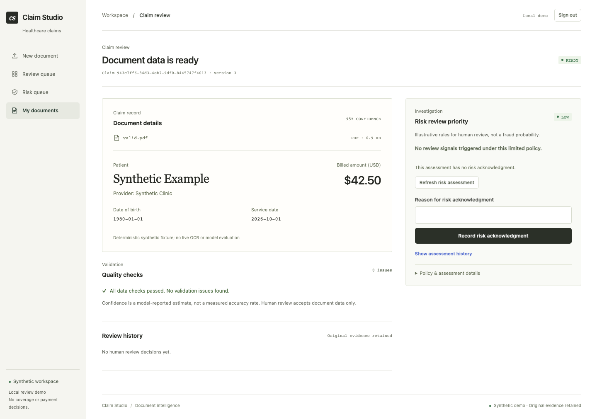
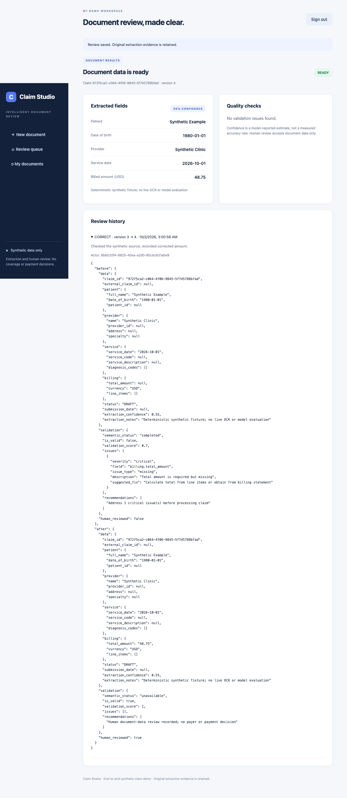

# Browser demo

Results include **Risk review priority** independently of document status. Read
the level, static reasons and policy/data/context timestamps. Not assessed does
not mean LOW; INSUFFICIENT_DATA means evaluation needs more evidence. HIGH is a
rule-based investigation priority, not a fraud probability.

Use **Refresh risk assessment** to capture changed peer context, or enter a reason
and **Record risk acknowledgment** to document investigation. This does not clear
computed risk or approve document data. A new assessment requires its own
acknowledgment. **Show assessment history** loads 20 records per page. Stale
mutation conflicts refresh the current result before displaying the error.

Open `/demo` at the exact PUBLIC_ORIGIN and sign in with the server-configured
DEMO_PASSWORD. The browser receives an opaque session and CSRF token, never
operator/provider credentials. Keep that session to revisit **My documents**.
A fresh login creates a new private workspace; signing out revokes access.

1. Download a clearly labeled synthetic sample from the upload screen.
2. Upload it; the API creates the claim/document and enqueues processing.
3. Follow status polling. Polling stops on success, review-required, rejection,
   failure, sign-out, navigation away, or a request error.
4. Inspect extracted fields, model-reported confidence, quality issues, and reasoning.
5. For review-required records, accept, correct and accept, or reject document data.
   Supply a reason. A correction reruns deterministic rules; version conflicts
   require reopening the current record. Original evidence remains unchanged.
6. Open review history to inspect the actor, timestamps, versions, and before/after
   snapshots. A failed job offers an explicit fresh retry.

Fixture mode (`SYNTHETIC_MODE=true`) accepts only byte-identical versioned samples
from `samples/manifest.json`. It does not call Azure or an LLM. Complete, missing
amount/low-confidence, and permanent provider-failure scenarios are labeled.
Live mode (`false`, default outside compose) uses the configured providers; its
actual behavior is not claimed by fixture checks. Corpus dates are fixed to
2026-10-01; deterministic age/date rules will eventually flag those dates as old.

The interface uses plain HTML/CSS/JavaScript served by FastAPI, bounded forms,
keyboard-accessible controls, visible loading/failed states, and textContent for
untrusted output. CSP permits only same-origin assets and forbids framing.

## Browser verification

With a dedicated migrated TEST_DATABASE_URL:

```bash
npm ci --prefix tests/browser
npm exec --prefix tests/browser -- playwright install chromium
uv run --locked python -m scripts.check_browser
```

The launcher starts separate API and worker processes on loopback port 8047 and
runs Chromium through login, upload, complete results, correction/audit, rejection,
failure/retry, listing, and logout. Its dedicated test DB must not contain
real/user data. It removes demo smoke records and session rows after completion.
Screenshots show this actual fixture flow, not a proposed interface:



